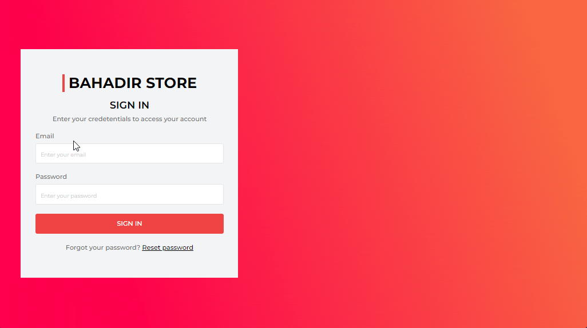

# Hi I'm Nurdoğan Bahadır 👋. Welcome to my Store Project with React.

This application is developed with React. Hooks, context structures, react router dom and axios were used with React. People who enter their membership information correctly can review the application. There is a products area in the application. In this area, the user can review the products.

# Live Link of the Project

[Click Me](https://store-app-nurdoganbahadir.netlify.app)

# Libraries and Technologies I use

- useState
- context
- tailwindCSS
- axios
- API
- react router dom

# How to install

In the project directory, open the terminal and run:

### `npm install`

This will install the necessary dependencies. After that, you can run:

### `npm start`

# How does my project look

